# Sistema de controle entrada e saída de veículos 

O Sistema consiste  na verificação de entrada e saída de veículos com finalidade de controlar os acessos nos locais restritos, visando manter a segurança, para essa finalidade foi criado um esboço da aplicação em uma diagrama de classe com relacionamento das classes, das quais são apresentadas as entidades com as características que vão ajudar na identificação do veículo como, código único, modelo, marca, cor, placa, o sistema terá também algumas funções importantes como adicionar, editar , pesquisar e excluir um veículo na sua base de dados, e assim manter maior controle dessas informações.
É um projeto inicial ao qual passará por novas versões até ser totalmente modelo, irão ocorrer testes e avaliações criteriosas focado na melhoria continua do desenvolvimento das suas funcionalidades que tem foco principal no controle e segurança.
No projeto serão usada as seguinte tecnologias no desenvolvimento desse projeto Java 11 , framework Spring Boot além de recursos adicionais com banco de dados.  
### Diagrama de classes
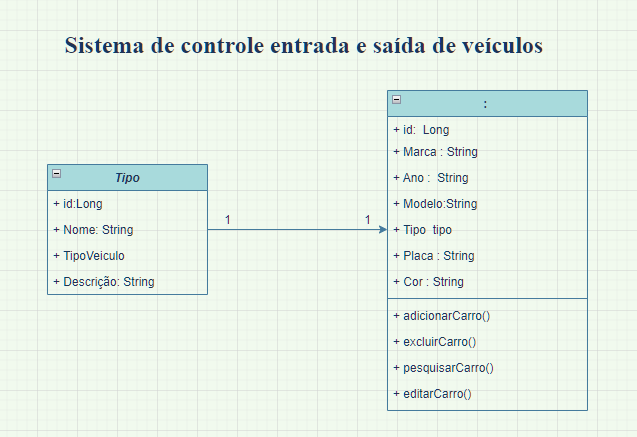

Depois de modelara o projeto com no diagrama de classes, foram cridas as classes do projeto conforme os requisitos do desafio da beca Java:

1. Modelar o Projeto criando entidades.
2. Entendimento dos protocolos Http e confecção dos controllers.
3. Introdução e confecção service.
4. Conexão com uma base de dados utilizando JPA.
5. Aplicar conceitos DTO no projeto.
6. Conceitos de validação, tratamento e manipulação de dados de forma otimizada.
7. Entendimento de como tratar possáveis erros na API.
8. Integração do API com Docker.

### Objetivo do projeto
Aplicação visa manter a segurança de qualquer veículo venha acessar um determinado local que seja restrito sua entrada, ao ser adicionado informações do veículo da sua placa, modelo, cor , marca e tipo, estará na base de dados daquele estabelecimento para tranquilidade dos clientes e das empresas.  
### Tecnologia aplicada:
* Java versão 11
* Spring Boot
* IntelliJ IDEA
* Postman
* Doker
* MySql

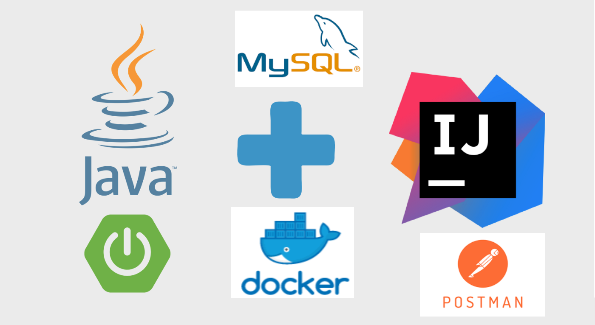
##### Teste realizado com método POST:
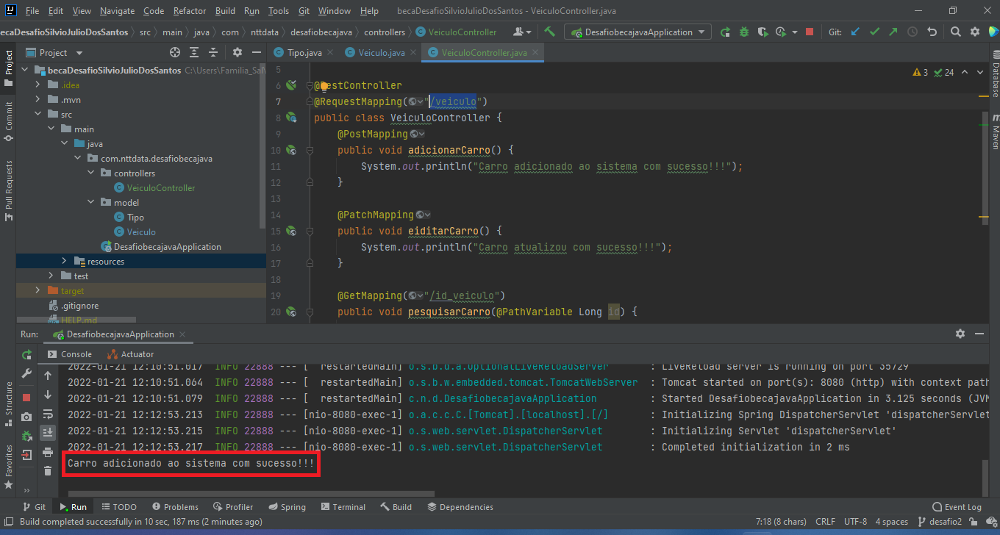
##### Realizado com método Patch:
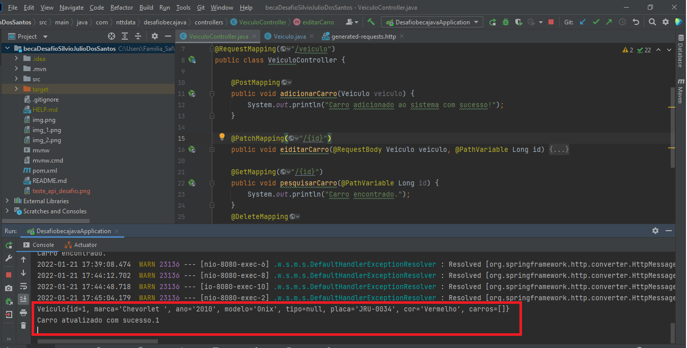

### Utilização banco de dados H2 console do Spring Boot com Postman e JSON

Após criar todas as classes da API REST com Spring boot, foram executadas testar dos Endpoints 
da API do projeto com H2 que possui embutido um banco de dados e que executar consultas SQL, 
ao qual foram verificado os seguintes métodos criar, editar, atualizar e excluir, utilizando os 
recursos do POSTMAN, vamos usar alguns verbos do HTTP que vai prover uma URL que vão 
indicar qual ação está sendo requisitada pelo consumidor do serviço, 
para  retornar do resultado foi
aplicado o JSON.
#####Depois  startar o projeto Spring no IntelliJ IEDA, podemos navegar para  que nos apresentará uma página de login do H2 console:
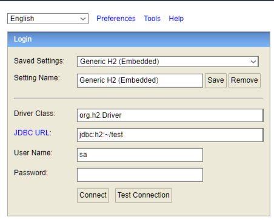

####Tela web inicial do H2 console com o banco de dados que executar SQL:
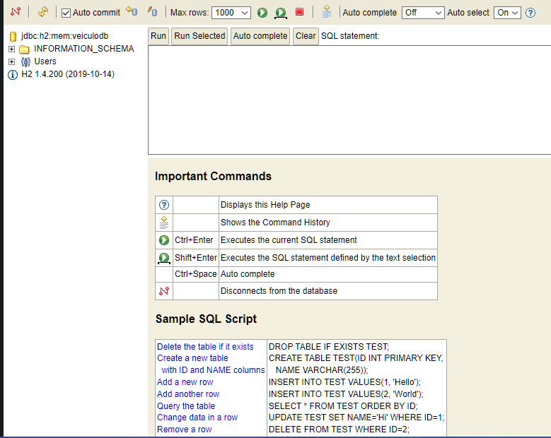
####Seguem exemplo abaixo dos verbos HTTP:

**Executando verbo POST para criar um objeto Veículo passando endpoint**

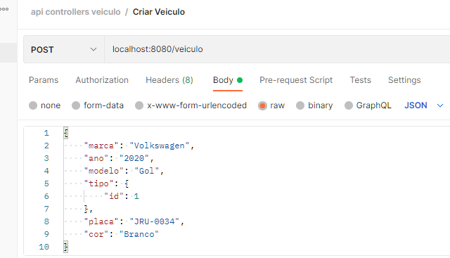

**Executando verbo GET para retornar uma lista objeto Veículo atarvés do endpoint**

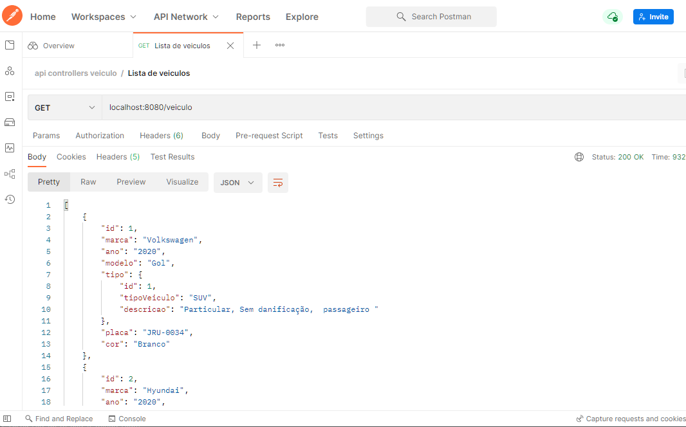

**Executando verbo PATCH passando um endpoint retornar um objeto Veículo que foi alterado**

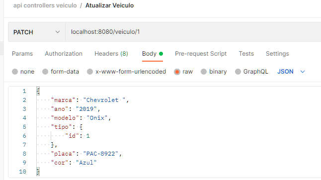

**Executando verbo DELETE passando um endpoint que retorna com informação veículo excluído**

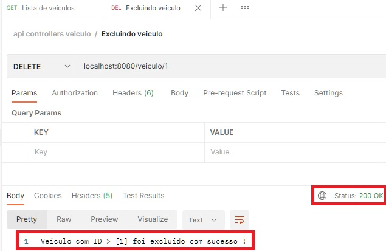

**Criando as tabelas através dos Endpoints do projeto Spring boot para banco de dados H2 console imagem abaixo:**

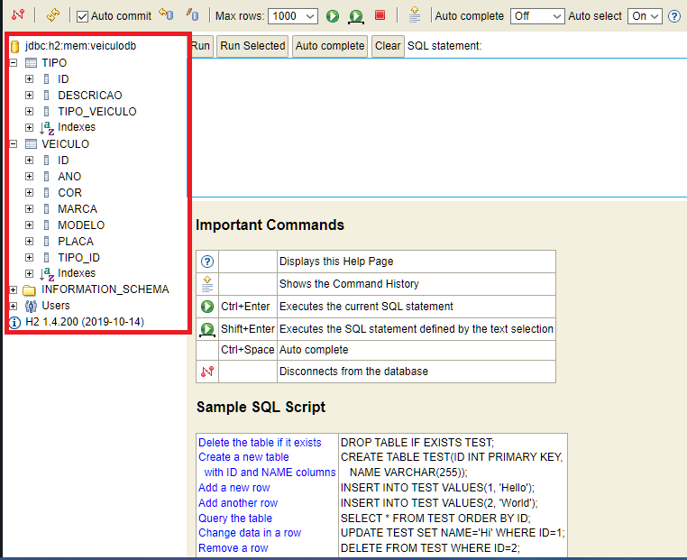

**Inserindo informações nas tabelas criadas com H2 console, exemplo imagem abaixo:**

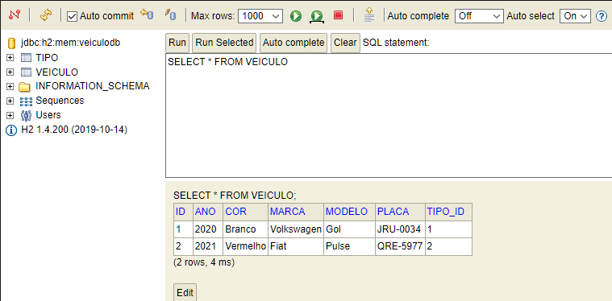

**Resultado da consulta MySql após realizar a inserção dos dados no Postman.**

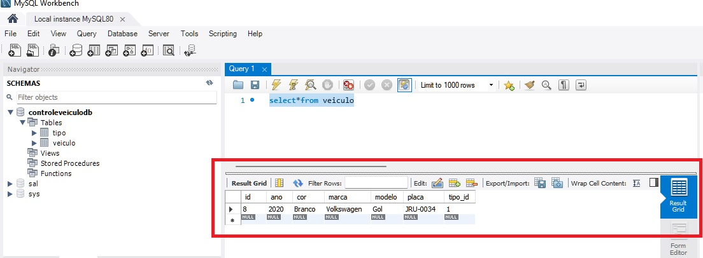

**Considerações finais:**

O projeto foi finalizado com alterações no código com inserção do Docker o qual foi criado 
uma imagem do MySql, ambos fazem parte da finalização do projeto beca Java, tanto Docker e MySql 
foram instalados no Sistema operacional Windows, e foi necessário fazer todas as configurações 
para ser usado no projeto conforme documentações dos fabricantes dos sistemas, futuramente vou dar 
continuidade ao projeto que vai passar por novas atualizações em breve, 
gerando melhorias no sistema.

**Agradecimentos:**
Quero agradecer ao meu mentor Vyttor Tavares, por todo suporte, conhecimento e
orientações necessárias na elaboração e conclusão do projeto de sistema 
de controle de veículos, e a toda equipe da NTT DATA Europe & LATAM.

**Autor:** Silvio Julio dos Santos